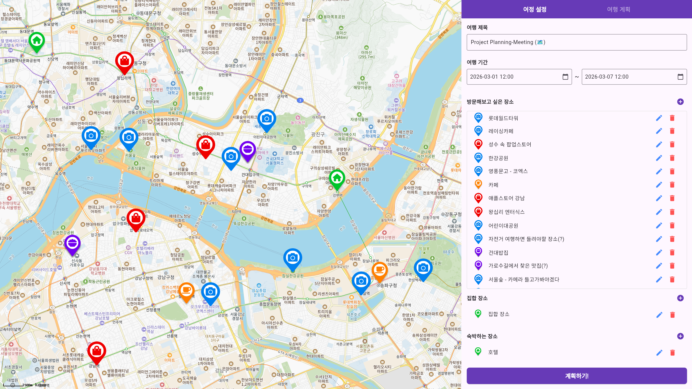
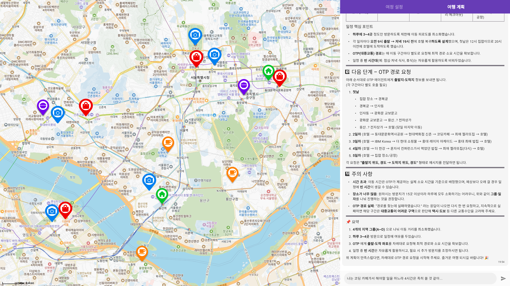

# Project. Planning Meeting (🗺️)

| 여행 초안                             | 여행 계획표                                |
|-----------------------------------|---------------------------------------|
|  |  |

Project. Planning Meeting (🗺️)는 Agent AI를 활용하여 여행 계획을 세워주는 프로그램입니다. 

여행을 계획하는 과정에는 이동 경로, 시간 분배 등 많은 시간과 노력이 필요합니다. 
특히 여러 명에서 특정 지역을 함께 여행을 가게된다면 개인마다 방문해보고 싶은 장소가 있을 것입니다.
그리고 적어도 한 사람은 여행 일정을 계획하곤 합니다. 

만약 Agent AI가 "가보고 싶은 장소를 모두 종합하여 사용자에게 여행 계획을 제공해주면 어떨까요?"라는 발상에 시작된 프로젝트입니다. 
여행을 가고 싶은 사용자는 그저 가고싶은 장소를 지도에 클릭하기만 하면 됩니다.  

그렇다고 인공지능이 여행 계획을 구성해줘도 실행하기 어려울 것입니다. 
누구는 A라는 장소에서 1시간 동안 머물고 싶고, 누구는 B라는 장소에서 10분만 머물고 싶을 수도 있습니다. 
이때 사용자는 LLM과 직접 소통을 하면서 여행 계획을 구성하는 것입니다. 
"나는 ㅇㅇ상점에서 1시간 동안 쇼핑할 것 같아."라고 말해주면 인공지능은 사용자의 요구사항을 반영한 여행 계획을 다시 세우게 됩니다. 
Agent AI를 이용하여 사용자 맞춤형 여행 계획을 제공하면 어떨까요? 

본 프로젝트는 IBM Korea, 데이터솔루션에서 진행한 IBM AI해커톤 출품 작품입니다. 
AI 오케스트레이션라는 기술을 활용하여 Agent AI는 사용자에게 최적의 여행 계획를 제공합니다.

## Reference
* [gunyu1019/planning_meeting-agent-ai](https://github.com/gunyu1019/planning-meeting-agent-ai]: 본 프로젝트에 사용되는 Agent AI의 Prompt(프롬포트)입니다.
* [gunyu1019/flutter-kakao-maps](https://github.com/gunyu1019/flutter_kakao_maps): 본 프로젝트에 사용된 카카오 지도 SDK 입니다.
* [IBM Cloud/WatsonX Orchestrate-d3](https://cloud.ibm.com/): 본 프로젝트의 필요한 Agent AI를 제공합니다.
* [Flyer Chat](https://flyer.chat/): LLM과 소통하기 위한 채팅 UI를 제공합니다.
* [Open Trip Planner](https://github.com/opentripplanner/OpenTripPlanner): 출발 지점에서 도착 지점까지 갈 수 있는 대중교통 경로를 제공하는 오픈소스 API입니다.
* [Korean Transport Database (KTDB)](https://www.ktdb.go.kr): 한국 GTFS(General Transit Feed Specification) 데이터베이스를 제공합니다.
